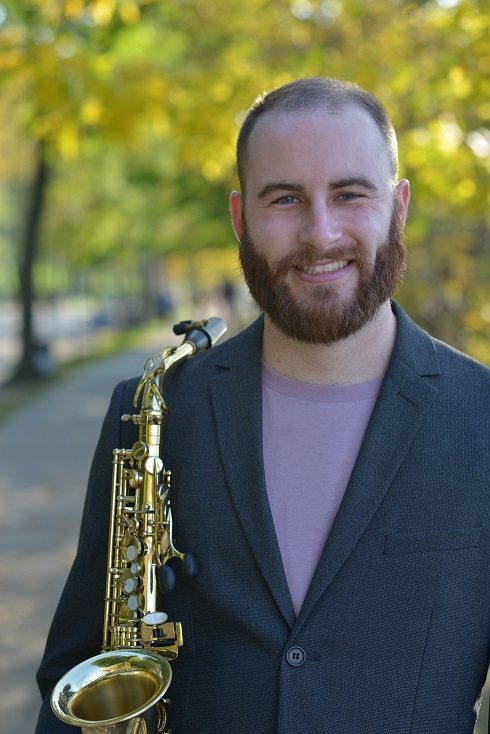
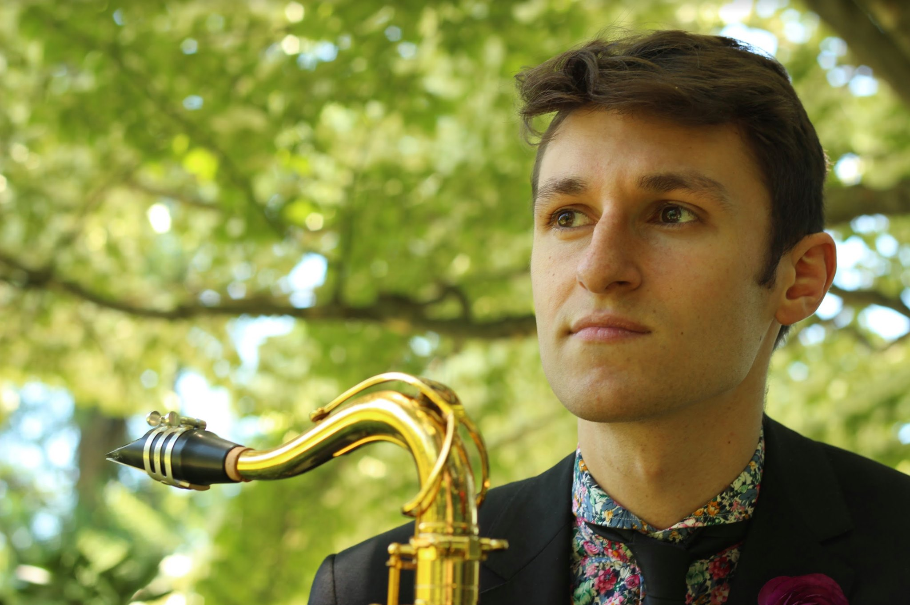
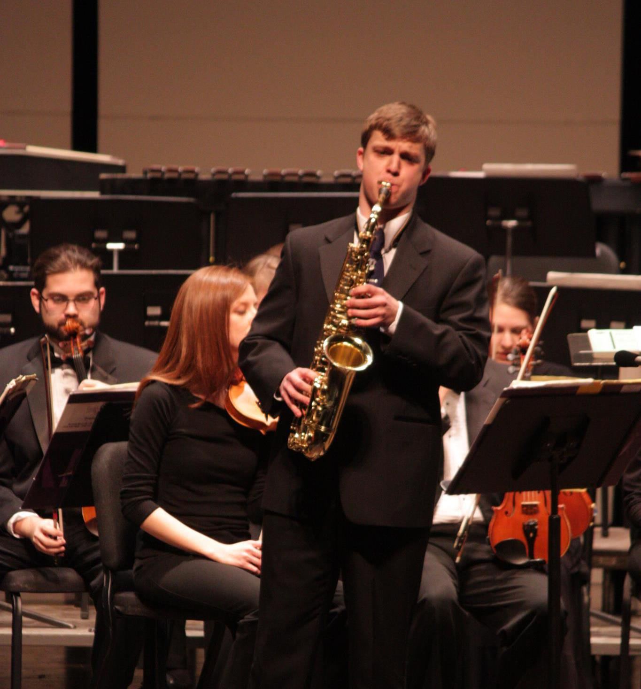

---
title: "About"
format:
  html:
    toc: false
    allow-html: true
---

::: {#about-page}

<h2 class="about-name">Zachary Robarge</h2>

Zach Robarge recently moved to Denver from Massachusetts, where he worked professionally as a woodwind doubler and educator, specializing in saxophones, flute/piccolo, clarinets, and oboe. Zach holds a bachelor’s degree in saxophone performance and music education, a performance certificate in flute and oboe studies, and in the spring of 2022, Zach graduated with his masters in classical saxophone performance, all from The University of Massachusetts. Most recently, Zach
Robarge was the Artist in Residence at The University of Massachusetts where he taught as Professor of Saxophone, filling in for his teacher and mentor Jonathan Hulting-Cohen while they were on sabbatical.

In his ten years of private teaching at the Community Music School of Springfield, and in the Belchertown School District in Massachusetts, Zach worked with hundreds of different students ranging in ages from 2nd grade through adulthood on all saxophones, clarinets, flute and piccolo, oboe, bassoon, and piano. Zach’s students are regularly offered solo and leadership positions in their school bands, and accepted into Regional, District, and Honor Bands. He also taught several students who have been accepted into collegiate music programs such as the saxophone and clarinet studios at The University of Massachusetts, as well as the flute and saxophone studios at the Hart School of Music.

In addition to his teaching, Zach maintains a busy and varied performance schedule. He has performed extensively with theater companies such as Barrington Stage Co and the Berkshire Theatre Group, as well as The Valley Winds, an award-winning community wind band based out of the pioneer valley. He has also played in a wide array of jazz/popular music groups, and chamber groups including big bands, jazz combos, saxophone trios and quartets, reed quintets, and other mixed chamber ensembles.

<h2 class="about-name">Tyler Clayton Appel</h2>

Tyler is like a character out of a book but real.

<h2 class="about-name">Benjamin Porter</h2>

Ben has never lost a game of Catan (to Merritt at least).

<h2 class="about-name">Erik Anundson</h2>

Merritt wishes she knew Erik better.

<footer class="site-footer">
  
&copy; 2025 Klock Quartet. All rights reserved.

</footer>
:::

