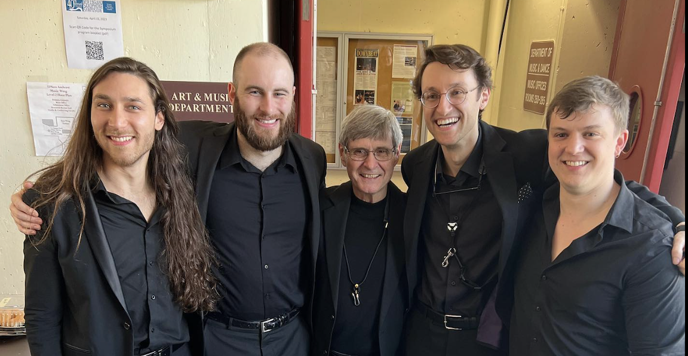
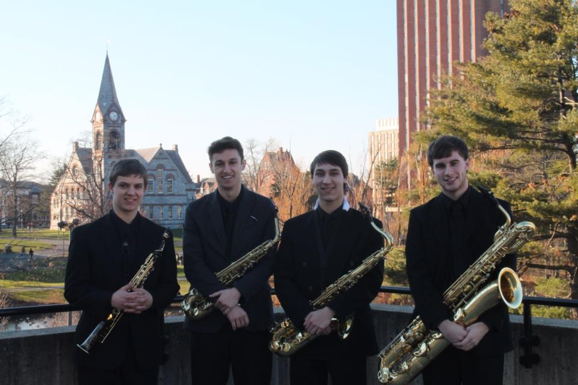
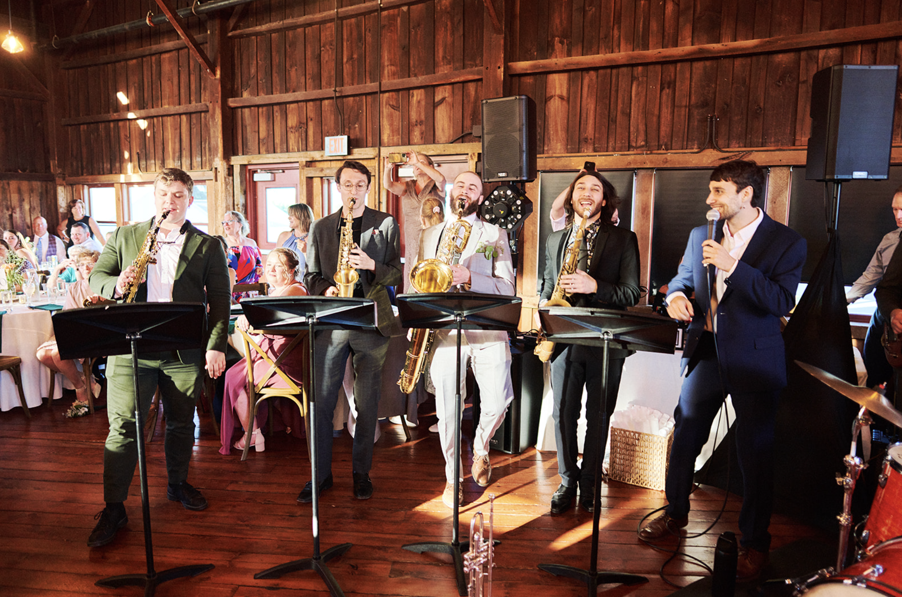

```{=html}
<!-- Image Slideshow -->
<div class="swiper mySwiper">
  <div class="swiper-wrapper">
    <div class="swiper-slide"></div>
    <div class="swiper-slide"></div>
    <div class="swiper-slide"></div>
    <div class="swiper-slide"></div>
  </div>

  <!-- Pagination -->
  <div class="swiper-pagination"></div>

  <!-- Navigation Arrows -->
  <div class="swiper-button-next"></div>
  <div class="swiper-button-prev"></div>
</div>

<!-- About Section -->
<section class="about-intro">
  <p>
    The Klock Quartet is a saxophone quartet formed by a tight-knit group of musicians who met as undergraduates at the University of Massachusetts Amherst.
    Mentored by renowned professor <strong>Lynn Klock</strong>, the group forged a lasting musical bond and friendship that continues to shape their distinctive sound today.
  </p>
  <p>
    With performances spanning from the <em>Saxophone Symposium</em> at the University of Massachusetts Amherst to weddings, schools, and community events,
    the Klock Quartet brings expressive playing, rich harmonies, and a fresh blend of styles to every stage.
  </p>
</section>

<!-- Footer -->
<footer class="site-footer">
  <p>&copy; 2025 Klock Quartet. All rights reserved.</p>
</footer>
```
